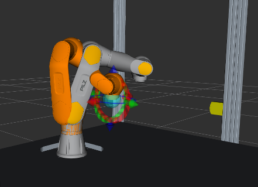

[](https://www.pilz.com)
# PILZ robot manipulator module PRBT 6 in ROS

## Package: pilz_robots
The meta package for the PILZ manipulator PRBT 6. Here you can find documentation of the individual packages. For a general overview and link collection we refer to the [wiki page](http://wiki.ros.org/pilz_robots).


### Installation
To use the packages, you can install prebuilt packages with
```
sudo apt install ros-$ROS_DISTRO-pilz-robots
```

### Build Status

|   | Kinetic | Melodic | Noetic
| ----| --------|-------- |-------- |
| Travis/Github CI  | [](https://travis-ci.org/PilzDE/pilz_robots) | [](https://github.com/PilzDE/pilz_robots/actions?query=event%3Apush+workflow%3ACI-Melodic+branch%3Amelodic-devel) | [](https://github.com/PilzDE/pilz_robots/actions?query=event%3Apush+workflow%3ACI-Noetic+branch%3Anoetic-devel) |
| Buildfarm src | [](http://build.ros.org/view/Ksrc_uX/job/Ksrc_uX__pilz_robots__ubuntu_xenial__source/) | [](http://build.ros.org/view/Msrc_uB/job/Msrc_uB__pilz_robots__ubuntu_bionic__source/) | [](http://build.ros.org/view/Nsrc_uF/job/Nsrc_uF__pilz_robots__ubuntu_focal__source/) |
| Buildfarm bin | [](http://build.ros.org/view/Kbin_uX64/job/Kbin_uX64__pilz_robots__ubuntu_xenial_amd64__binary/) | [](http://build.ros.org/view/Mbin_uB64/job/Mbin_uB64__pilz_robots__ubuntu_bionic_amd64__binary/)| [](http://build.ros.org/view/Nbin_uF64/job/Nbin_uF64__pilz_robots__ubuntu_focal_amd64__binary/) |


#### Branching model
`noetic-devel` is considered to be the active development branch.
Relevant changes are cherry-picked into `melodic-devel` or `kinetic-devel` on a case-by-case basis.


### Supported hardware versions
PRBT firmware version 1.1.0

If you want to update your PRBT firmware please contact our [repair center](https://www.pilz.com/en-INT/support/repair-service).


## Package: prbt_support
The package contains the robot description of the PRBT manipulator.
- `urdf/` contains the xacros for generating the urdf descriptions of the PILZ robot PRBT.
- `meshes/` contains the stl files for visualization
- `test/` contains test files for urdf
  - build tests: `catkin_make tests`
  - build and run tests: `catkin_make run_tests`
- `config/` defines the controllers and drivers. Loads the specialized `PilzTrajectoryController`.

### Pilz Coordinate Frames
To see the robot in rviz you can use
``roslaunch prbt_support test_urdf.launch``

The joint directions are illustrated in the following image:


### Configure the tcp
You can easily adjust the tool center point frame with an offset and rotation in the xacro file.

1. Open prbt_support/urdf/prbt.xacro
2. Edit the lines to your desired offset

```
  <xacro:unless value="$(arg gripper)">
    <xacro:arg name="tcp_offset_xyz" default="0 0 0"/>
    <xacro:arg name="tcp_offset_rpy" default="0 0 0"/>
  </xacro:unless>
```

Note: You can set a different default if you have a gripper attached.

## Package: prbt\_moveit\_config
The package is generated by moveit setup assistant. It contains configuration files and launch files needed
to start up the robot including planning and execution.



### Configuring the robot
Use the launch file `moveit_planning_execution.launch` to bring up the robot controllers
with the complete moveit pipeline.
The launch file allows to set optional parameters
* `sim` (default: True) <br>
    true: Use fake execution and display emulated robot position in RViz<br>
    false: connect to real robot using `ros_canopen`
* `pipeline` (default: ompl) <br>
    Planning pipeline to use with moveit
* `load_robot_description` (default: True)<br>
    Load robot description to parameter server. Can be set to false to let someone else load the model
* `rviz_config` (default: prbt_moveit_config/launch/moveit.rviz)<br>
    Start RViz with default configuration settings. Once you have changed the configuration and have saved
       it inside your package folder, set the path and file name here.
* `gripper` (default: None) <br>
    See [Running the prbt with a gripper](#running-the-prbt-with-a-gripper)
* `safety_hw` (default: pss4000)<br>
    Connect to the safety controller that handles the safe-torque-off signal.
	Only relevant for `sim:=False` to issue a Safe stop 1.
	See [prbt_hardware_support package](prbt_hardware_support/README.md).

### Running the simulation
1. Run `roslaunch prbt_moveit_config moveit_planning_execution.launch sim:=true pipeline:=ompl`
2. Use the moveit Motion Planning rviz plugin to plan and execute
   (see e.g. [ROS-I training exercise 3.4](https://industrial-training-master.readthedocs.io/en/melodic/_source/session3/Motion-Planning-RVIZ.html))

### Running on the real robot
1. Activate can interface: `sudo ip link set can0 up type can bitrate 1000000` (after every reboot or reconnect of the CAN hardware).
   For persistent configuration append the following to the file `/etc/network/interfaces`

```
auto can0
iface can0 can static
        bitrate 1000000
```

2. Run `roslaunch prbt_moveit_config moveit_planning_execution.launch sim:=false pipeline:=ompl`
3. Use the moveit Motion Planning rviz plugin to plan and execute (see simulation section; set `Velocity Scaling` to 0.1 first)

Instead of OMPL use the industrial motion planners of Pilz for executing industrial robot commands like PTP, LIN, etc. For this install the
package [pilz_industrial_motion_planner](http://wiki.ros.org/pilz_industrial_motion_planner):
```
sudo apt install ros-kinetic-pilz-trajectory-generation
or
sudo apt install ros-melodic-pilz-trajectory-generation
or
sudo apt install ros-noetic-pilz-industrial-motion-planner
```

then replace the pipeline in the above command by `pipeline:=pilz_industrial_motion_planner`.

### Adjust expert parameters
If you've created an application package with your own launch file as described in the
[tutorials](https://wiki.ros.org/pilz_robots/Tutorials/ModelYourApplicationWithPRBT#Create_your_application_ROS_package),
you can easily adjust many other configuration parameters.
See the comments in the [pilz_tutorials package](https://github.com/PilzDE/pilz_tutorials) and templates in the [pilz_templates repo](https://github.com/PilzDE/pilz_templates).

### Running the prbt with a gripper
Currently only the Schunk pg70 is supported. To run it, first install the package:
```
sudo apt install ros-$ROS_DISTRO-prbt-pg70-support
```

then start the robot like before but with the `gripper:=pg70` set. Both simulation and real robot work.

## Package: prbt_ikfast_manipulator_plugin
The package contains a moveit plugin for inverse kinematics of the manipulator, which is a
wrapper of `ikfast.cpp` to the kinematics base interface of moveit.

## Package: pilz_control
Contains a specialized version of `ros_controllers::JointTrajectoryController` which can be put into a holding mode.
A controlled stop using a hold trajectory is performed thus stopping the manipulator without the mechanical stress of a hard brake.
Further, the controller monitors cartesian speed and joint accelerations to fulfill the requirements of the selected operation mode.

**Topic interface deprecated:**
See [here](pilz_control/README.md)

## Package: prbt_hardware_support
This package provides support for the Pilz hardware PNOZmulti and PSS4000. A configurable modbus connection is set up via
`roslaunch prbt_hardware_support modbus_client.launch`. Particular features (detailed description [here](prbt_hardware_support/README.md)):
- Stop1 functionality
- Safe Brake Control functionality
- Operation modes T1 (reduced speed) and AUTOMATIC

## Package: prbt_gazebo
Provides a launch file to run the prbt manipulator inside gazebo.

## Package: pilz_status_indicator_rqt
This package defines an rqt-plugin to display information about the robots state to the user.
It will show:
* Current operation mode
* Operation state of the robot (PRBT)
* Operation state of the ROS system
* Current speed override


It can be launched with `rosrun pilz_status_indicator_rqt pilz_status_indicator_rqt` in a floating, standalone rqt instance. Alternatively it can be integrated in an existing rqt environment next to other widgets, if required.

## You need further information?
Our international hotline staff will support you individually about our ROS packages at
ros@pilz.de

Find more information about the Pilz manipulator module on the [product website](https://www.pilz.com/en-INT/eshop/00108002327111/PRBT-manipulator-modules).

## Visit us at [pilz.com](https://www.pilz.com)
Pilz is an international-scale, innovative automation technology company.
Pilz uses its solutions to create safety for man, machine and the environment.
In addition to head office in Ostfildern near Stuttgart,
the family business is represented over 2,400
employees at 42 subsidiaries and branches on all
continents.

The company’s products include sensor technology, electronic monitoring relays, safety
relays, configurable and programmable control systems, automation solutions with motion
control, systems for industrial communication as well as visualization solutions and
operator terminals.

Pilz solutions can be used in all areas of mechanical engineering, including the packaging
and automotive sector, plus the railway technology, press and wind energy sectors.
These solutions ensure that baggage handling systems run safely at airports and
funiculars or roller coasters travel safely; they also guarantee fire protection and energy
supply in buildings.
