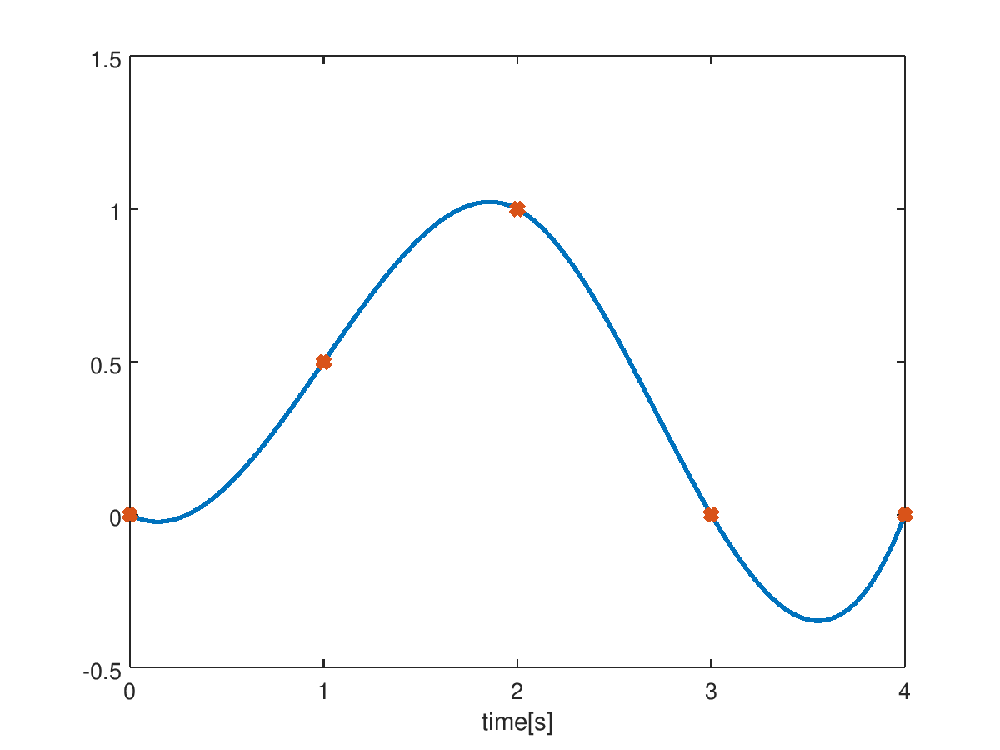
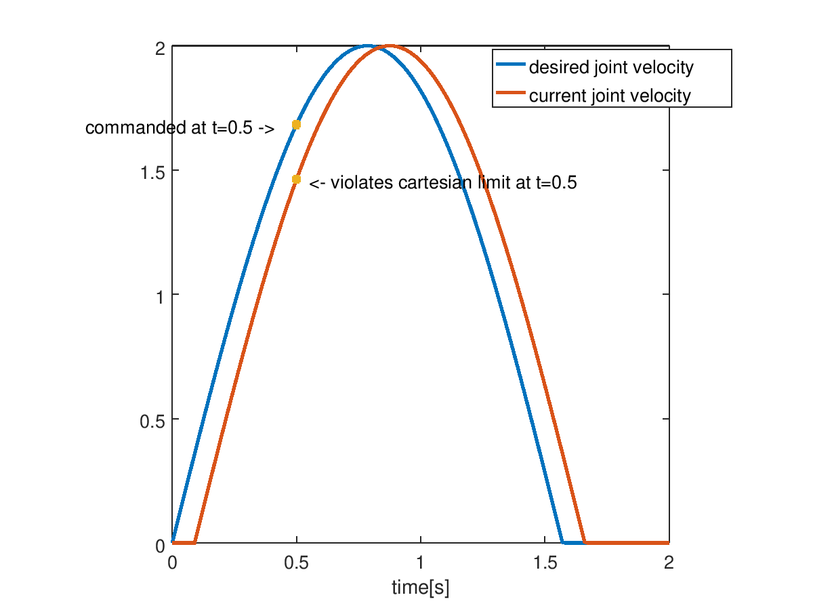
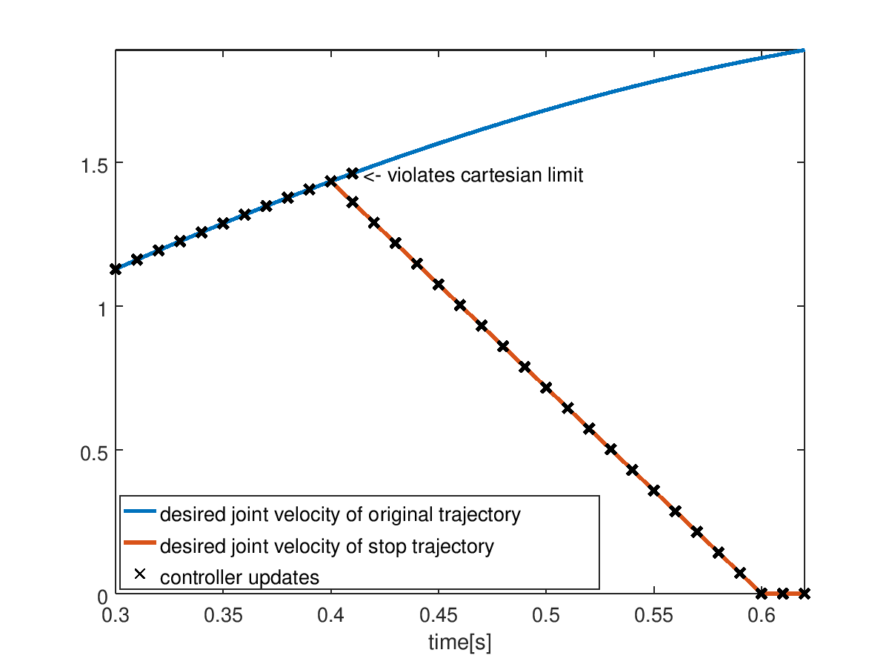
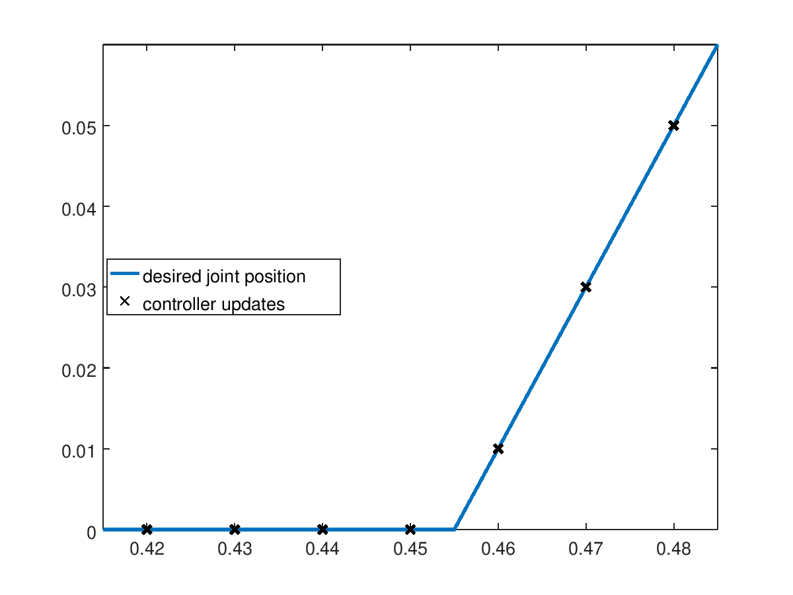
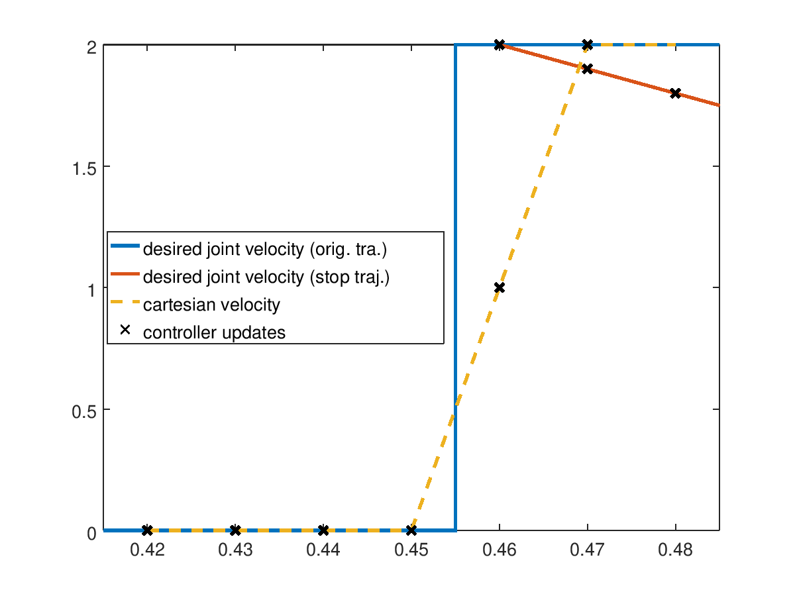

# Cartesian Velocity Limitation

Pilz GmbH \& Co. KG 
22.06.2020

This article describes the techniques used to limit the cartesian velocity of the robot links via the ``PilzJointTrajectoryController`` (PJTC). The PJTC inherits from the ``JointTrajectoryController`` (JTC) and so far added a *hold*-functionality for blocking the execution when no acknowledgement is given.

## Introduction to the JointTrajectoryController (JTC)

This is a brief explanation of the main concepts of the JTC which are needed in order to understand the implementation of the cartesian velocity limitation.

The JTC keeps a *trajectory*, which he tries to execute.

    curr_trajectory[]  // joint trajectory for joint1, joint2, ...

Each joint trajectory is divided into segments representing the trajectory on (usually) chronological time-intervals. The following figure shows a joint trajectory with 4 segments.

On each segment the trajectory is determined by an interpolation routine. It depends on the information the JTC gets from the caller, whether the interpolation is of 1st order (linear), 3-rd order (cubical) or 5-th order(quintic).

Additionally the JTC keeps a *desired state* end a *current state* of the robot, which is represented by its joints.

    desired_state:
    - position[]      // desired position of joint1, joint2, ...
    - velocity[]      // desired velocity of joint1, joint2, ...
    - acceleration[]  // ...
    current_state:
    - position[]
    - velocity[]
    - acceleration[]

The desired state represents a point on the trajectory and is obtained by interpolating on the currently active segment. The current state is given through the actual position of the robot. Usually the current state lags behind the desired state due to the delay in the communication with the robot hardware.

The states are updated via the JTC method *update()* which is triggered periodically by a controller manager. The procedure is as follows:

1. Update current state: read from hardware interface,
2. Update desired state: sample trajectory at current time,
3. Check path tolerances, etc.
4. Update hardware interface: command the desired state (or more advanced controller techniques).

## Notation

Let us denote \f$t_i\f$ the time of the \f$i\f$-th update and \f$\Delta t_{\mathrm{period}}=t_i-t_{i-1}\f$ the update period. Let us denote
\f[
    \hat{U}(t)=\left(\begin{array}{c}\hat{p}(t)\\\hat{v}(t)\\\hat{a}(t)\end{array}\right)\in\mathbb{R}^{3N}
\f]
the desired state at time \f$t\f$ with position \f$\hat{p}(t)\in\mathbb{R}^N\f$, velocity \f$\hat{v}(t)\in\mathbb{R}^N\f$ and acceleration \f$\hat{a}(t)\in\mathbb{R}^N\f$ and
\f[
    U(t)=\left(\begin{array}{c}p(t)\\v(t)\\a(t)\end{array}\right)\in\mathbb{R}^{3N}
\f]
the current state at time \f$t\f$, respectively. Here, \f$N\f$ is the number of joints.

We also introduce the robot links \f$l_1, \dots, l_M\f$, where \f$M\f$ denotes the number of robot links and a mapping \f$T_{j}:\mathbb{R}^N\to\mathbb{R}^3\f$, which maps a joint position to the translation from the robot base to link \f$l_j\f$: \f$p\mapsto T_{j}p\f$.

## Implementation of the Velocity Limitation

The crucial concepts used in the Implementation of the velocity limitation in the PJTC are the *Cartesian Speed Monitoring*, the *Stop Trajectory* and the *Acceleration Limitation in Joint Space*.

### Cartesian Speed Monitoring

The ``CartesianSpeedMonitor`` is used by the PJTC to check the desired state before it gets written to the hardware interface. So this check was added to step 3 of the update routine.

At the \f$i\f$-th update the cartesian velocity of link \f$l_j\f$ is approximated by the following formula (using the desired position):
\f[
    w_{j}^{(i)} = \frac{\left\|\operatorname{T}_{j}\hat{p}(t_i)-\operatorname{T}_{j}\hat{p}(t_{i-1})\right\|_{2}}{\Delta t_{\mathrm{period}}}.
\f]
This makes sense since our robot is commanded by position values. In case one of the computed velocities is above the velocity limit, a stop trajectory is triggered.

This approach tries to prevent the desired state from violating the limit such that the same holds for the current state. A "reacting" approach, which checks the current (actual) state of the robot has proven not sufficient due to the delay in the communication with the hardware.

### The Stop Trajectory

A controlled stop of the robot is accomplished by replacing the currently held trajectory with a stop trajectory. The stop trajectory consists of a single segment which is computed from the given start state \f$S_{\mathrm{stop}}\f$, the start time \f$t_{\mathrm{stop}}\f$ and the stop duration \f$\Delta t_{\mathrm{stop}}\f$. The stop duration \f$\Delta t_{\mathrm{stop}}\f$ is a pre-defined constant that is given through the controller configuration.

**Q:** How to choose \f$S_{\mathrm{stop}}\f$ and \f$t_{\mathrm{stop}}\f$ whilst maintaining a continuous movement?

Suppose we are running the \f$i\f$-th update and a stop is triggered. The desired state \f$\hat{U}(t_i)\f$ is not commanded to the hardware yet. So the overall movement will be continuous if the stop trajectory is attached to the desired state of the last update:
\f{eqnarray*}{
    S_{\mathrm{stop}} &:=& \hat{U}(t_{i-1}),\\
    t_{\mathrm{stop}} &:=& t_{i-1}.
\f}

### When and Why the Stopping Failes

For a simple demonstration of the problem, we assume a robot with a single joint, i.e. \f$N=1\f$ and a distance of \f$r=1.0\f$ to the outmost link \f$l_M\f$. In this setting the joint velocity is equal to the cartesian velocity of link \f$l_m\f$. For the approximated cartesian velocity we get:
\f{eqnarray*}{
    w_M^{(i)} &\approx& \frac{|\hat{p}(t_i)-\hat{p}(t_{i-1})|}{\Delta t_{\mathrm{period}}} > w_{M-1}^{(i)} > \dots > w_1^{(i)}.
\f}

Now we regard a trajectory with linear interpolation on the segments:

This trajectory is continuous in the position, but not in the velocity. The velocity is constant on each trajectory segment, so it "jumps" in between:

However, the approximated cartesian velocity is much lower in one update after the jump (\f$t=0.46\f$). These approximated values better reflect the actual resulting movement of the robot. So the violation of the cartesian velocity limit happens at \f$t=0.47\f$ despite the desired joint velocity already reached \f$\hat{v}=2.0\f$ at \f$t=0.46\f$. The result is a stop trajectory which begins at \f$\hat{v}=2.0\f$.

In this setting the velocity limit can be exeeded arbitrarily through the stop trajectory. We can conclude that the choice of the start state for the stop trajectory is not well suited for trajectories with linearly interpolated segments.

### Acceleration Limitation in Joint Space

The acceleration limitation in joint space is a workaround in order to finally prevent a violation of the cartesian velocity limit in a reliable way.

We consider a (joint-wise) approximation to the acceleration in the desired joint trajectory as follows (the actual formula is more differentiated, here we assume \f$\hat{v}(t_i), \hat{v}(t_{i-1})>0\f$):
\f[
    \tilde{a}^{(i)} := \frac{\hat{v}(t_i)-\hat{v}(t_{i-1})}{\Delta t_{\mathrm{period}}}
\f]
It holds \f$\tilde{a}^{(i)}>0\f$ if the joint accelerates and \f$\tilde{a}^{(i)}<0\f$ if the joint decelerates. By introducing an upper limit for \f$\tilde{a}^{(i)}\f$ the magnitude of jumps like the one depicted above can be controlled. This allows to control the magnitude of a possible limit violation. In order to prevent a violation of the cartesian velocity limit a lower surrogate limit has to be introduced.

## Appendix

Let us proof
\f[
    w_M^{(i)} &\approx& \frac{|\hat{p}(t_i)-\hat{p}(t_{i-1})|}{\Delta t_{\mathrm{period}}}.
\f]
The movement of a robot with a single rotational axis can be expressed in \f$2\f$ dimensions. Let the origin be \f$\left(\begin{array}{c}0\\0\end{array}\right)\f$. The rotational matrix is given by
\f[
    R(p) := \left(\begin{array}{rr}\cos(p)&-\sin(p)\\ \sin(p)&\cos(p)\end{array}\right).
\f]
Without loss of generality we assume that for joint position $p_0=0$ the translation to link \f$l_M\f$ is \f$T_Mp_0=\left(\begin{array}{c}1\\0\end{array}\right)\f$ (remember \f$r=1.0\f$). Then for arbitrary \f$p\f$ we get:
\f[
    T_Mp := R(p)\left(\begin{array}{c}1\\0\end{array}\right) = \left(\begin{array}{c}\cos(p)\\ \sin(p)\end{array}\right)
\f]
and therefore:
\f{eqnarray*}{
    \|T_Mp-T_M(p+\delta)\|_2^2 &:=& \left\|\left(\begin{array}{r}\cos(p)-\cos(p+\delta)\\ \sin(p)-\sin(p+\delta)\end{array}\right)\right\|_2^2\\
    &=& (\cos(p)-\cos(p+\delta))^2+(\sin(p)-\sin(p+\delta))^2\\
    &=& \cos^2(p)+\sin^2(p)+\cos^2(p+\delta)+\sin^2(p+\delta)-2\cos(p)\cos(p+\delta)\\
    && \phantom{\cos^2(p)+\sin^2(p)+\cos^2(p+\delta)+\sin^2(p+\delta)}-2\sin(p)\sin(p+\delta)\\
    &=& 1+1-2\cos(p)\cos(p+\delta)-2\sin(p)\sin(p+\delta).
\f}
Now using \f$\sin(x)\sin(y)=\frac{1}{2}(\cos(x-y)-\cos(x+y))\f$ and \f$\cos(x)\cos(y)=\frac{1}{2}(\cos(x-y)+\cos(x+y))\f$, we get
\f{eqnarray*}{
    \|T_Mp-T_M(p+\delta)\|_2^2  &=& 2-\cos(\delta)-\cos(2p+\delta)-\cos(\delta)+\cos(2p+\delta)\\
    &=& 2-2\cos(\delta).
\f}
We conclude \f$\|T_Mp-T_M(p+\delta)\|_2=\sqrt{2-2\cos(\delta)}\approx|\delta|\f$ for \f$\delta<1\f$ and
\f{eqnarray*}{
    w_M^{(i)} &=& \frac{\|T_Mp-T_M(p+\delta)\|_2}{\Delta t_{\mathrm{period}}}\\
    &\approx& \frac{|\delta|}{\Delta t_{\mathrm{period}}}\\
    &=& \frac{|p-(p+\delta)|}{\Delta t_{\mathrm{period}}},
\f}
which completes the proof.
