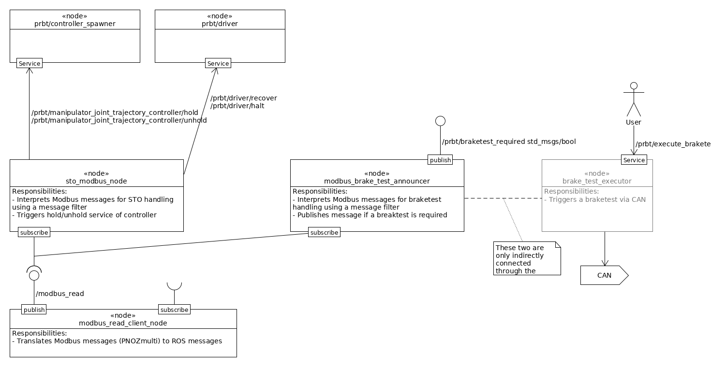

# Overview
The prbt_hardware_support package contains files needed to control hardware functions of the PRBT manipulator like STO for Stop1 functionality. The Pilz hardware PNOZmulti is supported using a Modbus connection.

There is no need to call these launch files directly; they are included from `prbt_support/robot.launch`.

# Safe stop 1 (SS1)
The STO function (“Safe torque off”) of the robot arm is a safety function to immediately turn off torque of the drives. To allow a
controlled stop, the safety controller is allowed to delay the STO signal by several milliseconds. This package opens a
modbus connection to the safety controller (currently PNOZmulti). The safety controller sends an emergency
stop signal via Modbus immediately so that ros_control has a short time interval to stop the drives via a brake ramp.
The TCP could for example brake on the current trajectory. After execution of the brake ramp, the drivers are halted. Even if ROS would fail, the safety controller turns off the motors via STO (that would be a Stop 0 then).

## Possible error cases and their handling

| Error cases                                             | Handling                                                |
| ------------------------------------------------------- | ------------------------------------------------------- |
| Modbus client crashes                                   | ROS system is shutdown which leads to an abrupt stop of the robot. |
| STO Modbus adapter crashes                              | ROS system is shutdown which leads to an abrupt stop of the robot. |
| Connection loss between PNOZmulti & Modbus client        | Stop 1 is triggered                                     |
| System overload (messages don't arrive in time)         | In case a Stop 1 message does not arrive in time, PNOZmulti will automatically perform a hard stop. In case a Stop 1-release message does not get through, brakes will remain closed. |
| STO Modbus adapter cannot connect to stop services    | ROS system will not start.                              |
| STO Modbus adapter cannot connect to recover services | Node does start and robot can be moved until a stop is triggered. Afterwards the brakes will remain closed. |

# Communcation Structure

# ROS API

## ModbusClient
A Modbus client (for usage with the PNOZmulti) can be started with `roslaunch prbt_hardware_support modbus_read_client.launch`.

### Published Topics
- ~/pilz_modbus_node/modbus_read (prbt_hardware_support/ModbusMsgInStamped)
  - Holds information about the modbus holding register. Timestamp is only updated if the register content changed.

### Parameters
- modbus_server_ip
- modbus_server_port
- index_of_first_register_to_read
- num_registers_to_read
- modbus_connection_retries (default: 10)
- modbus_connection_retry_timeout - timeout between retries (default: 1s)

## StoModbusAdapterNode
The ``PilzStoModbusAdapterNode`` is noticed via the topic `/modbus_read` if the STO is true or false and reacts as follows calling the corresponding services of the controllers and drivers:
- **STO true:**
enable drives, unhold controllers
- **STO false:**
hold controllers, disable drives
