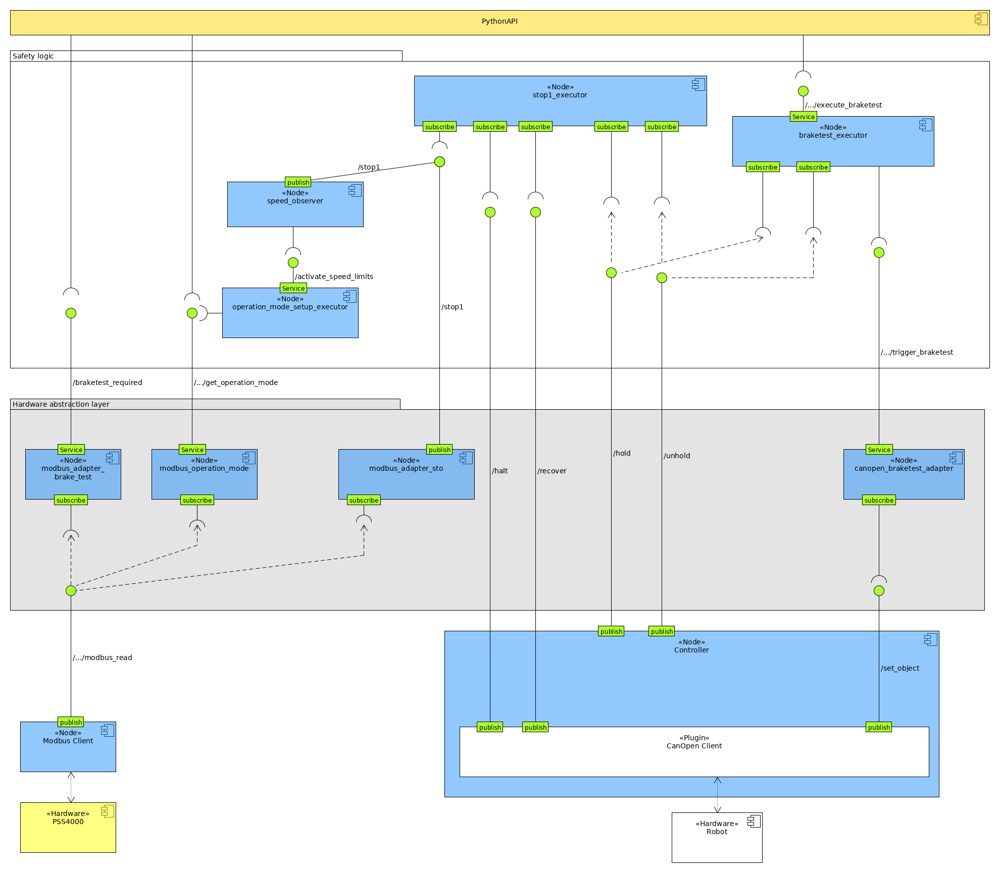
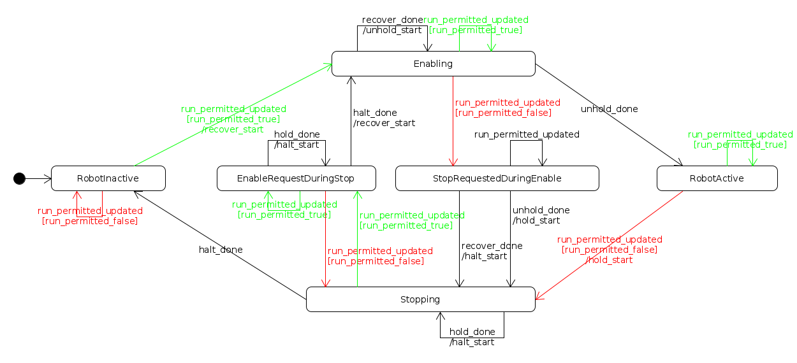

## Overall system architecture
The following diagram shows all components of the system and the connections
between them.

## State machine of stop 1 executor
The following diagram shows the internal state machine of the stop 1 executor.

